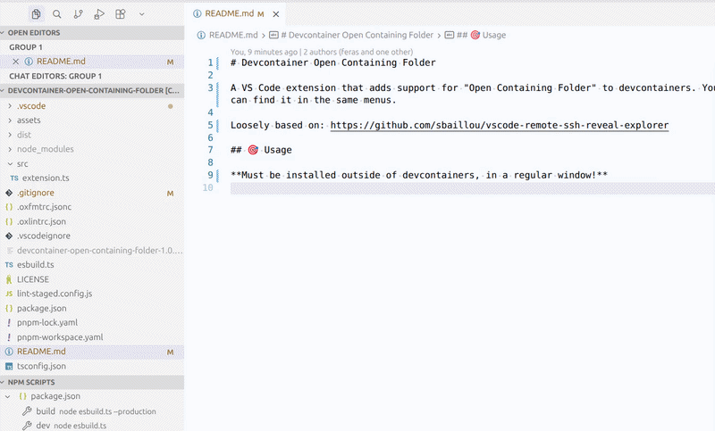

# Devcontainer Open Containing Folder

**Must be installed outside of devcontainers, in a regular window!**

A VS Code extension that adds support for "Open Containing Folder" to devcontainers. You can find it in the same menus.

**Tested on Linux and Windows.** (If you can either confirm that it works on macOS or contribute support for it if not, please create an issue/PR or send me an email!)

Loosely based on: https://github.com/sbaillou/vscode-remote-ssh-reveal-explorer

